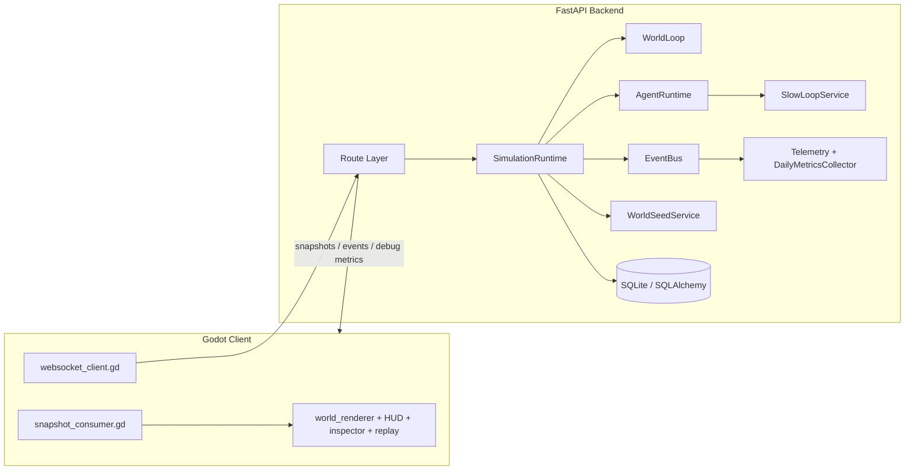
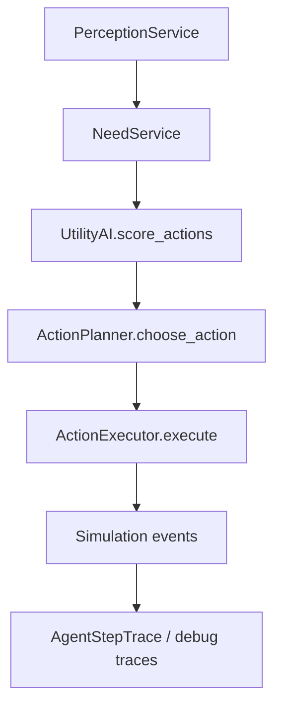
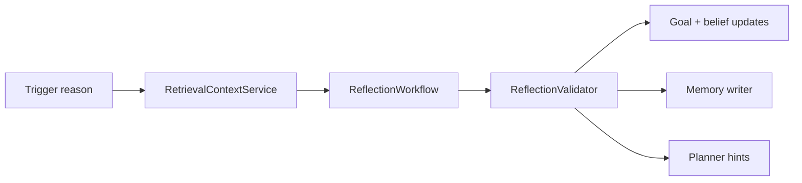
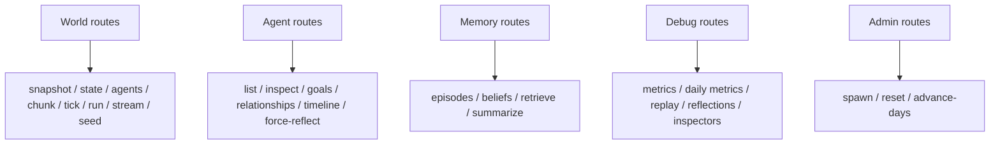
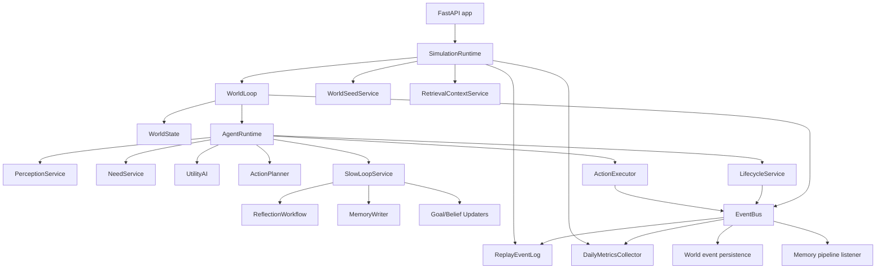
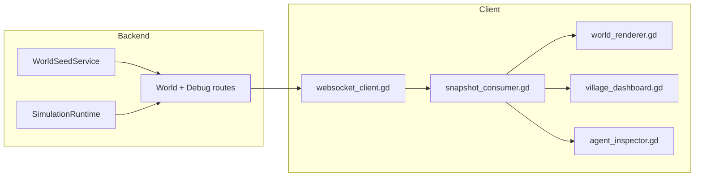

# Autonomous Village Architecture

This document is the deeper technical companion to [README.md](/Users/ryankenny/Projects/AiAgentExperiment/README.md). It focuses on how the system is built, how state and control flow through it, and where the important architectural boundaries live.

## 1. Architectural Intent

Autonomous Village is designed as a **server-authoritative simulation** with a **presentation-only Godot client**.

That split is the most important architectural rule in the repository:

- the **backend** owns simulation truth
- the **client** owns rendering and debugging UX

Concretely, the backend is responsible for:

- simulation ticks and time progression
- world state mutation
- action legality and execution
- planning and task generation
- memory retrieval and writing
- slow-loop reflection and planner hints
- social systems, bonding, reproduction, and lifecycle events
- persistence
- replay, telemetry, and daily metrics

The Godot client is responsible for:

- rendering tiles, buildings, and agents
- camera and UI
- inspector, replay, and dashboard surfaces
- consuming snapshots, event batches, and debug metrics
- visual interpolation and overlays

The client must not become authoritative for:

- agent state
- inventory/resources
- memory
- relationships
- pregnancy/birth
- planning
- action outcomes

## 2. System Overview

## 3. Backend Architecture

### 3.1 Entry point and app assembly

Primary backend entry point:

- [server/app/main.py](/Users/ryankenny/Projects/AiAgentExperiment/server/app/main.py)

Responsibilities:

- create the FastAPI app
- create `SimulationRuntime`
- start the runtime on app startup
- stop the runtime on shutdown
- register route groups

The app is assembled around a single shared runtime stored on `app.state.simulation_runtime`.

### 3.2 Runtime orchestration

Primary runtime object:

- [server/app/engine/tick_loop.py](/Users/ryankenny/Projects/AiAgentExperiment/server/app/engine/tick_loop.py)

`SimulationRuntime` owns:

- the in-memory authoritative `WorldState`
- the simulation clock
- scheduler
- event bus
- replay log
- telemetry recorder
- daily metrics collector
- memory/retrieval helpers
- slow-loop reflection service
- lifecycle and reproduction services
- seed bootstrap/reset behavior
- debug/query surfaces for routes

This class is the highest-value file in the backend for onboarding because it shows how the subsystems are actually wired together.

### 3.3 World tick ordering

World-level ticking is handled by:

- [server/app/engine/world_loop.py](/Users/ryankenny/Projects/AiAgentExperiment/server/app/engine/world_loop.py)

Per tick, the rough ordering is:

1. advance clock
2. finalize previous day metrics if day rolled over
3. update world weather/resources/crops
4. emit day-rollover event if needed
5. dispatch scheduled tasks
6. step all agents
7. flush telemetry
8. return a snapshot

That ordering matters because the project relies on a clear simulation boundary:

- world changes first
- agents react to the updated world
- events and metrics observe the resulting state

### 3.4 World state model

Authoritative in-memory state is defined in:

- [server/app/engine/world_state.py](/Users/ryankenny/Projects/AiAgentExperiment/server/app/engine/world_state.py)

Important runtime types:

- `WorldState`
- `AgentState`
- `TileState`
- `ItemStackState`
- `ResourceNodeState`

`AgentState` is intentionally broad and includes:

- position
- needs
- mood-adjacent fields
- household/partner links
- current action and goal
- task queue and payload
- planner hints
- beliefs and memories
- inventories and skills
- lifecycle flags such as pregnancy and infant care duty

This is a pragmatic v1 design: broad agent state in-memory, richer long-lived graphs in persistence.

## 4. Fast Loop: Perception -> Utility -> Planner -> Executor

The fast loop is coordinated in:

- [server/app/agents/runtime.py](/Users/ryankenny/Projects/AiAgentExperiment/server/app/agents/runtime.py)

### 4.1 Perception

- [server/app/agents/perception.py](/Users/ryankenny/Projects/AiAgentExperiment/server/app/agents/perception.py)

Perception produces a compact local context:

- visible agents
- visible items
- visible resources
- nearby food/water/threat
- nearby infants
- nearest target coordinates
- weather / terrain / sim hour

This keeps the planner and executor grounded in explicit local state rather than hidden world queries everywhere.

### 4.2 Utility scoring

- [server/app/agents/utility_ai.py](/Users/ryankenny/Projects/AiAgentExperiment/server/app/agents/utility_ai.py)

The utility layer scores candidate actions from needs and perception. This is not a behavior tree or GOAP system; it is a compact rule-based scoring layer.

### 4.3 Planning

- [server/app/agents/planner.py](/Users/ryankenny/Projects/AiAgentExperiment/server/app/agents/planner.py)

The planner does two jobs:

1. choose the top action candidate
2. expand it into concrete ordered tasks

Examples:

- `drink` -> `fetch_water` -> `drink`
- `socialize` -> `greet` -> `talk`
- `feed_household` -> move/retrieve/cook/share chain

The planner is also where **planner hints** bias behavior. Those hints:

- come from reflection
- are normalized and stored on the runtime agent
- rerank candidates or enrich tasks
- do **not** bypass executor legality

### 4.4 Execution

- [server/app/agents/executor.py](/Users/ryankenny/Projects/AiAgentExperiment/server/app/agents/executor.py)

The executor:

- applies task effects to authoritative state
- enforces legality and preconditions
- emits task and domain events
- updates current action/task progress
- fails safely when the action is illegal or impossible

This is the system that turns planned intent into world mutation.

## 5. Slow Loop, Memory, and Reflection

The slow loop is the higher-level cognition layer. It is intentionally separated from the fast loop so reflective output can guide behavior without directly controlling low-level execution.

### 5.1 Main files

- [server/app/cognition/slow_loop.py](/Users/ryankenny/Projects/AiAgentExperiment/server/app/cognition/slow_loop.py)
- [server/app/cognition/reflection.py](/Users/ryankenny/Projects/AiAgentExperiment/server/app/cognition/reflection.py)
- [server/app/cognition/validation.py](/Users/ryankenny/Projects/AiAgentExperiment/server/app/cognition/validation.py)
- [server/app/memory/retrieval.py](/Users/ryankenny/Projects/AiAgentExperiment/server/app/memory/retrieval.py)
- [server/app/memory/writer.py](/Users/ryankenny/Projects/AiAgentExperiment/server/app/memory/writer.py)

### 5.2 Current reflection flow

### 5.3 Important maturity note

The pipeline is real and tested, but the actual model integration is still limited:

- reflection output is structured
- validation is enforced
- planner-hint handoff is implemented
- token-cost accounting is scaffolded
- the current model client is still effectively stub-like rather than a real external LLM deployment

That means the architecture is in place, but the AI-model realism is not yet the finished story.

## 6. Social Systems and Lifecycle

### 6.1 Bonding

- [server/app/social/bonding.py](/Users/ryankenny/Projects/AiAgentExperiment/server/app/social/bonding.py)

Bonding is explicit and rule-based:

- adulthood / alive checks
- attraction, trust, familiarity thresholds
- social opportunity checks
- rejection cooldown
- bond scoring
- pair bond creation/update

### 6.2 Reproduction

- [server/app/social/reproduction.py](/Users/ryankenny/Projects/AiAgentExperiment/server/app/social/reproduction.py)
- [server/app/agents/lifecycle.py](/Users/ryankenny/Projects/AiAgentExperiment/server/app/agents/lifecycle.py)

Reproduction is lifecycle-driven and backend-authoritative:

- social/bond windows
- pair bond formation
- conception checks
- pregnancy progression
- infant creation
- kinship linking
- household assignment
- parent goal seeding

### 6.3 Important boundary

Nothing in Godot owns bonding, pregnancy, birth, kinship, or inheritance truth. The client only visualizes what the backend exposes.

## 7. Persistence Model

Persistence is handled through SQLAlchemy models in:

- `server/app/db/models/*`
- repository helpers in [server/app/db/repositories/agents.py](/Users/ryankenny/Projects/AiAgentExperiment/server/app/db/repositories/agents.py)

Important persistent entities include:

- `Agent`
- `Relationship`
- `PairBond`
- `Pregnancy`
- agent goals/needs/skills/traits
- persisted world events

### Persistence maturity

The architecture is **mixed-mode** today:

- some simulation truth is in-memory runtime state only
- some longer-lived graphs and event records persist through the DB

That is acceptable for current scope, but it is not yet a fully unified “restart and resume everything” persistence model.

## 8. API Architecture

Main route groups:

- [server/app/api/routes_world.py](/Users/ryankenny/Projects/AiAgentExperiment/server/app/api/routes_world.py)
- [server/app/api/routes_agents.py](/Users/ryankenny/Projects/AiAgentExperiment/server/app/api/routes_agents.py)
- [server/app/api/routes_memory.py](/Users/ryankenny/Projects/AiAgentExperiment/server/app/api/routes_memory.py)
- [server/app/api/routes_debug.py](/Users/ryankenny/Projects/AiAgentExperiment/server/app/api/routes_debug.py)
- [server/app/api/routes_admin.py](/Users/ryankenny/Projects/AiAgentExperiment/server/app/api/routes_admin.py)

### Route families

### Notable route behavior

- `/api/v1/world/stream`
  - websocket stream for seed + snapshot/event batches
- `/api/v1/debug/metrics/daily`
  - current in-progress metrics preview plus finalized history
- `/api/v1/admin/advance-days/{days}`
  - explicitly a **clock jump**, not a true long-running simulation fast-forward

## 9. Metrics, Replay, and Debugging

Observability is handled in:

- [server/app/telemetry/metrics.py](/Users/ryankenny/Projects/AiAgentExperiment/server/app/telemetry/metrics.py)
- [server/app/telemetry/replay.py](/Users/ryankenny/Projects/AiAgentExperiment/server/app/telemetry/replay.py)
- [server/app/telemetry/observability.py](/Users/ryankenny/Projects/AiAgentExperiment/server/app/telemetry/observability.py)

Daily observability currently includes grouped metrics for:

- population
- welfare
- social
- economy
- cognition

The observability layer combines:

- event-driven counters
- state-driven aggregation
- reflection telemetry

It now also supports:

- current in-progress daily metrics preview
- latest finalized metrics
- recent finalized history

## 10. Godot Client Architecture

### 10.1 Main scenes

- [client-godot/scenes/Main.tscn](/Users/ryankenny/Projects/AiAgentExperiment/client-godot/scenes/Main.tscn)
- [client-godot/scenes/world/WorldRoot.tscn](/Users/ryankenny/Projects/AiAgentExperiment/client-godot/scenes/world/WorldRoot.tscn)
- [client-godot/scenes/ui/HUD.tscn](/Users/ryankenny/Projects/AiAgentExperiment/client-godot/scenes/ui/HUD.tscn)

The top-level scene graph is intentionally simple:

- transport node
- world node
- HUD/debug node

### 10.2 Client transport

- [client-godot/scripts/networking/websocket_client.gd](/Users/ryankenny/Projects/AiAgentExperiment/client-godot/scripts/networking/websocket_client.gd)

Behavior:

- websocket-first live transport
- HTTP fallback when websocket is unavailable
- separate debug metrics request path
- throttled debug metrics polling so the client does not hammer the backend every snapshot

### 10.3 Snapshot consumer

- [client-godot/scripts/networking/snapshot_consumer.gd](/Users/ryankenny/Projects/AiAgentExperiment/client-godot/scripts/networking/snapshot_consumer.gd)

This is the main client-side coordinator. It:

- validates snapshot payloads
- projects them into presentation-safe state
- updates the world renderer
- updates the HUD/debug panels
- caches selected-agent view state

### 10.4 Rendering and debug UI

- [client-godot/scripts/world/world_renderer.gd](/Users/ryankenny/Projects/AiAgentExperiment/client-godot/scripts/world/world_renderer.gd)
- [client-godot/scripts/agents/agent_visual_controller.gd](/Users/ryankenny/Projects/AiAgentExperiment/client-godot/scripts/agents/agent_visual_controller.gd)
- [client-godot/scripts/ui/hud.gd](/Users/ryankenny/Projects/AiAgentExperiment/client-godot/scripts/ui/hud.gd)
- [client-godot/scripts/ui/village_dashboard.gd](/Users/ryankenny/Projects/AiAgentExperiment/client-godot/scripts/ui/village_dashboard.gd)

The dashboard now prefers backend daily metrics when available, but still falls back to simpler snapshot-derived stats if needed.

## 11. Deterministic Seed Architecture

Seed data is shared conceptually across backend and client, but the backend remains the authoritative bootstrap path.

Primary files:

- [client-godot/data/world_seeds/v1_village_seed.json](/Users/ryankenny/Projects/AiAgentExperiment/client-godot/data/world_seeds/v1_village_seed.json)
- [server/app/services/world_seed_service.py](/Users/ryankenny/Projects/AiAgentExperiment/server/app/services/world_seed_service.py)

The backend:

- loads the raw seed
- expands terrain regions to tiles
- exposes a typed seed definition for the client
- can build a runtime `WorldState` from it

The client:

- receives the seed definition from the backend
- renders the world from that authoritative seed description

## 12. Testing Strategy

The repository has strong backend coverage and lightweight client validation.

### Backend tests

Important areas:

- `server/tests/agents`
- `server/tests/social`
- `server/tests/integration`
- `server/tests/telemetry`
- `server/tests/unit`

These cover:

- action execution
- planner mappings
- planner hints
- reproduction lifecycle
- runtime/API integration
- debug metrics surfaces
- world seed contracts

### Client validation

The Godot side uses lightweight validation scripts, especially:

- [client-godot/scripts/testing/presentation_layer_checks.gd](/Users/ryankenny/Projects/AiAgentExperiment/client-godot/scripts/testing/presentation_layer_checks.gd)

These are intentionally modest:

- snapshot contract acceptance
- seed definition acceptance
- dashboard binding
- presentation-boundary checks
- throttling guard behavior

There is not yet a full Godot CI scene-test harness.

## 13. Architecture Risks and Current Tradeoffs

### Intentional tradeoffs

- broad in-memory `AgentState` for speed and simplicity
- partial persistence where it adds value first
- rule-based planner/executor before deeper behavior systems
- structured but still stub-driven reflection model path
- practical Godot validation rather than heavyweight engine-native testing

### Current architectural risks

- runtime state and persistent state are not yet fully unified
- some admin/debug paths intentionally behave differently from “real” simulation ticking
- client-side visualization/debug features can still drift unless API contracts stay tight
- some systems are broad in feature count but still shallow in realism

## 14. Recommended Reading Order

For engineers or AI agents, the highest-value code reading order is:

1. [server/app/main.py](/Users/ryankenny/Projects/AiAgentExperiment/server/app/main.py)
2. [server/app/engine/tick_loop.py](/Users/ryankenny/Projects/AiAgentExperiment/server/app/engine/tick_loop.py)
3. [server/app/engine/world_loop.py](/Users/ryankenny/Projects/AiAgentExperiment/server/app/engine/world_loop.py)
4. [server/app/engine/world_state.py](/Users/ryankenny/Projects/AiAgentExperiment/server/app/engine/world_state.py)
5. [server/app/agents/runtime.py](/Users/ryankenny/Projects/AiAgentExperiment/server/app/agents/runtime.py)
6. [server/app/agents/planner.py](/Users/ryankenny/Projects/AiAgentExperiment/server/app/agents/planner.py)
7. [server/app/agents/executor.py](/Users/ryankenny/Projects/AiAgentExperiment/server/app/agents/executor.py)
8. [server/app/cognition/slow_loop.py](/Users/ryankenny/Projects/AiAgentExperiment/server/app/cognition/slow_loop.py)
9. [server/app/api/routes_world.py](/Users/ryankenny/Projects/AiAgentExperiment/server/app/api/routes_world.py)
10. [client-godot/scenes/Main.tscn](/Users/ryankenny/Projects/AiAgentExperiment/client-godot/scenes/Main.tscn)
11. [client-godot/scripts/networking/snapshot_consumer.gd](/Users/ryankenny/Projects/AiAgentExperiment/client-godot/scripts/networking/snapshot_consumer.gd)

## 15. Appendix: Deeper Diagrams

### Full simulation subsystem view

### Backend to client data boundary

