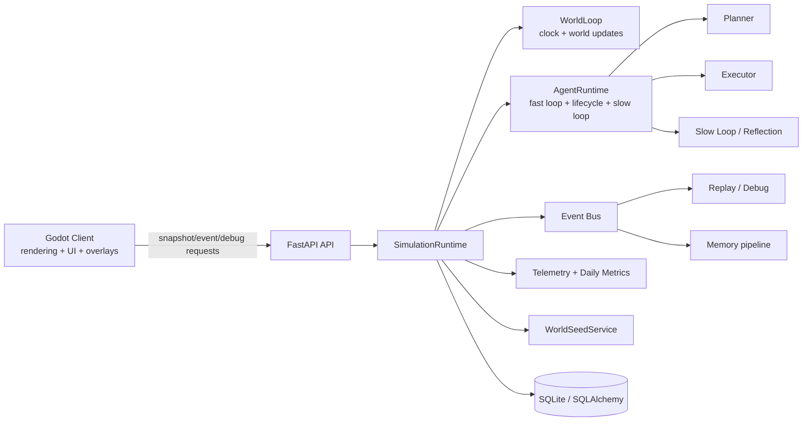
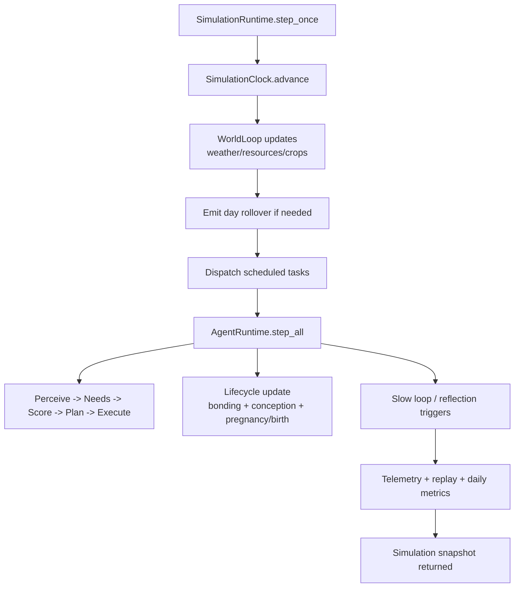
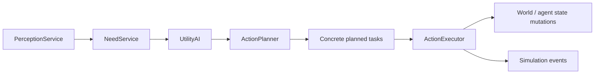
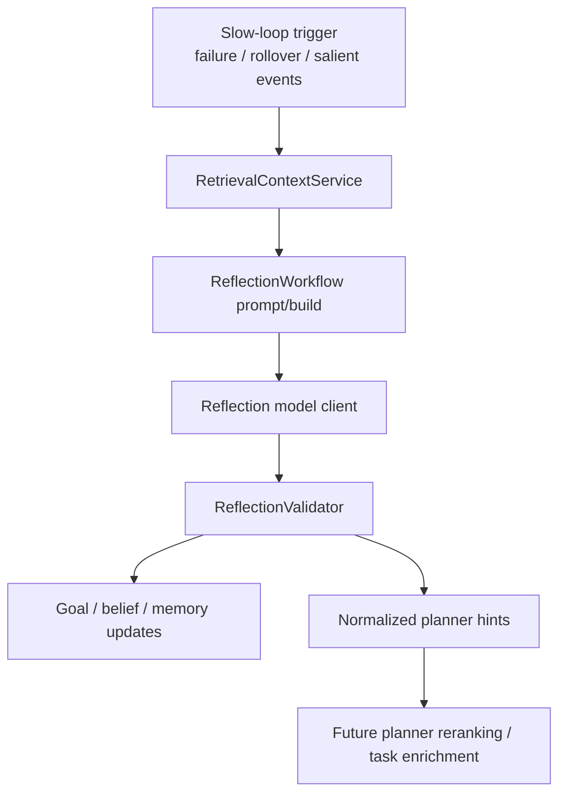
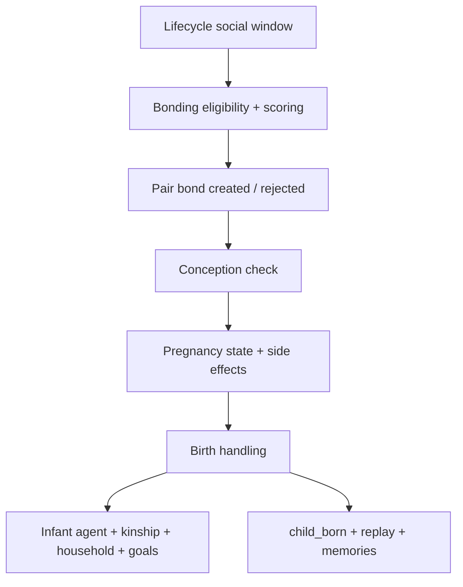
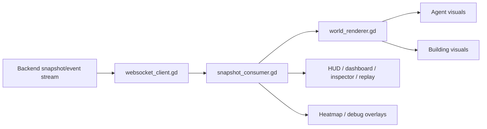
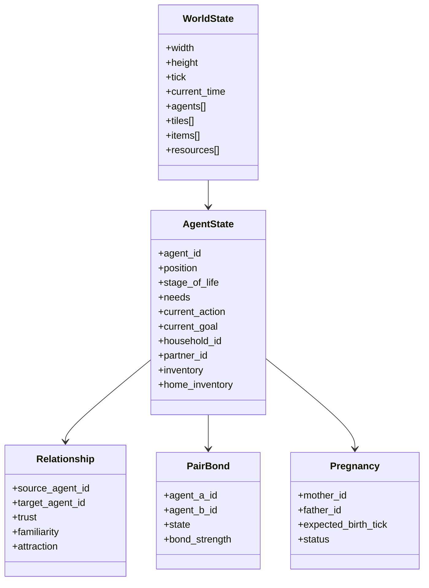
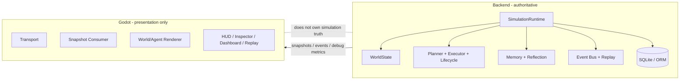
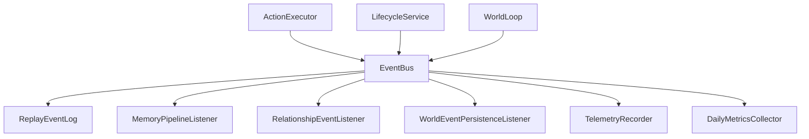
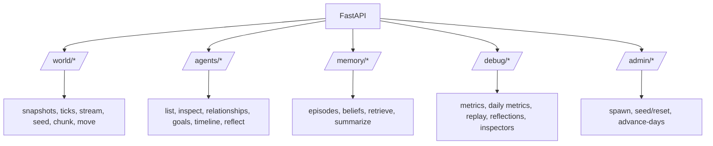

# Autonomous Village

## Overview

Autonomous Village is a server-authoritative AI village simulator with a Godot client for rendering and debugging. The backend owns simulation truth: world state, ticks, agent decisions, actions, memory/retrieval, reflection, social systems, reproduction, observability, and API/debug surfaces. The Godot client is presentation-only: it renders the seeded village, consumes authoritative snapshots and event batches, and exposes inspector/dashboard/replay views for humans.

Today, this repository is beyond a scaffold. It already contains:

- a running FastAPI backend with an authoritative simulation runtime
- a deterministic world seed and seed-loading path shared between backend and client
- a multi-loop agent architecture with planning, execution, memory, reflection, lifecycle, reproduction, and debug telemetry
- a Godot project that renders the village and consumes live backend state
- a broad automated test suite covering backend behavior and API contracts

It is still an evolving simulation, not a finished game. Some subsystems are intentionally compact or stubbed, and several “v1” systems are present as honest first implementations rather than deep, production-hardened models.

## What It Does

### Implemented

- **Authoritative simulation runtime**
  - world ticks and time progression
  - weather/resource/crop updates
  - event bus and replay/debug event capture
  - background simulation loop via FastAPI lifespan

- **Agent fast loop**
  - perception
  - need updates
  - utility scoring
  - rule-based planning
  - action execution

- **Action catalog (v1)**
  - survival: move, eat, drink, sleep, rest, flee
  - work: gather/fish/fetch water/plant/harvest/chop/cook/store/retrieve
  - social: greet/talk/give/help/insult/apologize/court/propose_bond/comfort/mourn
  - family: care/escort/teach/share_food_home

- **Memory and reflection**
  - episodic and belief-style memory surfaces
  - retrieval context assembly
  - reflection validation and structured output
  - planner hints from reflection into fast-loop planning

- **Social and lifecycle systems**
  - relationship persistence hooks
  - pair bonding
  - pregnancy and birth
  - infant creation, kinship linking, parent goal seeding

- **Deterministic world seed**
  - fixed `v1_village` map and population
  - backend seed bootstrap
  - client seed bootstrap and rendering

- **Debugging and observability**
  - snapshots, replay, inspection, memory, agent control, admin controls
  - daily metrics aggregation
  - current/latest/recent daily metrics debug surfaces
  - verification scripts for key flows

- **Godot presentation layer**
  - world renderer
  - agent/building visuals
  - HUD, inspector, village dashboard, replay/event feed
  - live transport with websocket-first plus HTTP fallback

### Partially implemented

- **Reflection LLM integration**
  - the reflection pipeline exists, but the model client is still effectively stubbed/deterministic rather than backed by a real production LLM

- **Memory system depth**
  - retrieval and memory writing exist, but this is still a compact simulation-facing memory model, not a full production semantic memory system

- **Dialogue**
  - dialogue preparation exists, but there is not yet a fully realized natural-language character conversation system

- **Economy/world simulation depth**
  - resource gathering, crops, food, water, and household pressure exist, but the economy is still simplified

- **Client polish**
  - the Godot client is useful and much clearer than a raw debug screen, but it is still a debug-first village viewer rather than a finished player UX

### Planned / implied but not fully built yet

- richer generational/childcare systems
- more realistic relationship dynamics and long-term social memory
- stronger persistence integration across all runtime systems
- real model usage accounting and cost reporting
- richer client replay, overlays, and debugging views
- broader seed/world editing and scenario variety

## Architecture

The project is a monorepo with a strict boundary:

- **Backend = authority**
- **Godot client = presentation**



### Major subsystem boundaries

- `server/app/engine/*`
  - owns authoritative world ticking, event bus, scheduler, clock, and runtime orchestration
- `server/app/agents/*`
  - owns fast-loop agent decision making and action execution
- `server/app/cognition/*`
  - owns slow-loop reflection, validation, goals, beliefs, and prompt/model plumbing
- `server/app/memory/*`
  - owns retrieval, memory writing, summarization, and memory-side services
- `server/app/social/*`
  - owns bonding, reproduction, inheritance, childcare helpers, and social rules
- `server/app/api/*`
  - exposes world/agent/memory/debug/admin routes
- `client-godot/*`
  - consumes backend state and renders/debugs it without becoming authoritative

## Core Flows

### 1. Simulation tick flow

The authoritative runtime runs in the backend process. Each tick advances the simulation, updates the world, then steps all agents.



### 2. Agent fast loop

Each agent uses a rule-based fast loop with explicit state and legality checks.



Important design note:
- planner hints from reflection bias planning
- they do **not** bypass legality or directly command low-level execution

### 3. Memory / reflection / planner-hint flow

The slow loop is structured, validated, and intentionally separate from the fast loop.



### 4. Reproduction / lifecycle flow

The reproduction system is backend-only and lifecycle-driven.



### 5. Client snapshot rendering flow

The Godot client is a consumer, not a source of truth.



## Repository Structure

This repo is organized by responsibility rather than by deployment artifact alone.

```text
/
├── client-godot/   Godot presentation project
├── server/         FastAPI backend, simulation runtime, tests, scripts
├── docs/           Short architecture/API/design notes
├── ops/            Prometheus/Grafana/Loki placeholders
├── docker-compose.yml
└── .env.example
```

### `server/`

This is the core of the project. It contains:

- `app/agents/`
  - action catalog, planner, executor, runtime coordination, needs, perception
- `app/api/`
  - world, agent, memory, debug, and admin routes
- `app/cognition/`
  - reflection workflow, validators, prompt/model plumbing, goal/belief updates
- `app/db/`
  - SQLAlchemy models, enums, session helpers, repositories
- `app/engine/`
  - world state, world loop, tick loop, event bus, scheduler, sim clock
- `app/memory/`
  - retrieval, writing, summaries, memory-oriented service helpers
- `app/social/`
  - bonding, reproduction, inheritance, childcare, social helpers
- `app/telemetry/`
  - tick telemetry, replay, inspection, daily observability metrics
- `migrations/`
  - Alembic migration support
- `tests/`
  - broad backend coverage by subsystem and integration level
- `scripts/`
  - seed/verification scripts for major flows

### `client-godot/`

This is the viewer/debug client. It contains:

- `scenes/`
  - `Main`, `WorldRoot`, `HUD`, `AgentSprite`, `Building`, inspector/dashboard/replay scenes
- `scripts/networking/`
  - websocket-first transport, snapshot consumer, fallback polling
- `scripts/world/`
  - world rendering and map/building reconciliation
- `scripts/agents/`
  - agent visual interpolation and render-state handling
- `scripts/ui/`
  - HUD, inspector, dashboard, replay, overlay behavior
- `scripts/validation/` and `scripts/testing/`
  - lightweight presentation-boundary and scene-level validation hooks
- `data/world_seeds/`
  - deterministic shared seed data used by both backend and client

### `docs/`

The docs folder exists, but it is still relatively high-level and partial. The code is currently a more complete source of truth than these docs.

## Key Modules

### Backend entrypoint

- [server/app/main.py](/Users/ryankenny/Projects/AiAgentExperiment/server/app/main.py)
  - creates the FastAPI app
  - starts/stops `SimulationRuntime`
  - wires route groups

### Runtime orchestration

- [server/app/engine/tick_loop.py](/Users/ryankenny/Projects/AiAgentExperiment/server/app/engine/tick_loop.py)
  - central runtime object
  - owns world state, event bus, telemetry, replay, slow loop, lifecycle, and debug surfaces
- [server/app/engine/world_loop.py](/Users/ryankenny/Projects/AiAgentExperiment/server/app/engine/world_loop.py)
  - orders per-tick world updates and agent stepping
- [server/app/engine/world_state.py](/Users/ryankenny/Projects/AiAgentExperiment/server/app/engine/world_state.py)
  - authoritative in-memory state model for the current world

### Fast-loop agent stack

- [server/app/agents/runtime.py](/Users/ryankenny/Projects/AiAgentExperiment/server/app/agents/runtime.py)
  - runs the full agent step and records debug traces
- [server/app/agents/planner.py](/Users/ryankenny/Projects/AiAgentExperiment/server/app/agents/planner.py)
  - expands objectives into executable task chains
- [server/app/agents/executor.py](/Users/ryankenny/Projects/AiAgentExperiment/server/app/agents/executor.py)
  - applies legal task effects to authoritative state
- [server/app/agents/utility_ai.py](/Users/ryankenny/Projects/AiAgentExperiment/server/app/agents/utility_ai.py)
  - scores candidate actions from current needs/perception

### Cognition and memory

- [server/app/cognition/slow_loop.py](/Users/ryankenny/Projects/AiAgentExperiment/server/app/cognition/slow_loop.py)
  - coordinates retrieval + reflection + structured updates
- [server/app/cognition/reflection.py](/Users/ryankenny/Projects/AiAgentExperiment/server/app/cognition/reflection.py)
  - reflection workflow and compatibility path
- [server/app/memory/retrieval.py](/Users/ryankenny/Projects/AiAgentExperiment/server/app/memory/retrieval.py)
  - retrieval context assembly for reflection/dialogue
- [server/app/memory/writer.py](/Users/ryankenny/Projects/AiAgentExperiment/server/app/memory/writer.py)
  - memory write path

### Social and lifecycle

- [server/app/social/bonding.py](/Users/ryankenny/Projects/AiAgentExperiment/server/app/social/bonding.py)
  - bond eligibility, scoring, acceptance/rejection, pair-bond persistence hooks
- [server/app/social/reproduction.py](/Users/ryankenny/Projects/AiAgentExperiment/server/app/social/reproduction.py)
  - conception, pregnancy, birth, infant creation, kinship, parent goals
- [server/app/agents/lifecycle.py](/Users/ryankenny/Projects/AiAgentExperiment/server/app/agents/lifecycle.py)
  - lifecycle updates that run alongside fast-loop simulation

### Seeds and debug surfaces

- [server/app/services/world_seed_service.py](/Users/ryankenny/Projects/AiAgentExperiment/server/app/services/world_seed_service.py)
  - deterministic seed loading and world-state construction
- [server/app/api/routes_world.py](/Users/ryankenny/Projects/AiAgentExperiment/server/app/api/routes_world.py)
  - snapshots, world streaming, seeds, ticks, chunk views
- [server/app/api/routes_debug.py](/Users/ryankenny/Projects/AiAgentExperiment/server/app/api/routes_debug.py)
  - replay, reflections, inspections, metrics
- [server/app/telemetry/observability.py](/Users/ryankenny/Projects/AiAgentExperiment/server/app/telemetry/observability.py)
  - daily metrics aggregation and in-progress preview

### Godot client

- [client-godot/scenes/Main.tscn](/Users/ryankenny/Projects/AiAgentExperiment/client-godot/scenes/Main.tscn)
  - root scene containing transport, world root, and HUD
- [client-godot/scripts/networking/websocket_client.gd](/Users/ryankenny/Projects/AiAgentExperiment/client-godot/scripts/networking/websocket_client.gd)
  - websocket-first transport with HTTP fallback
- [client-godot/scripts/networking/snapshot_consumer.gd](/Users/ryankenny/Projects/AiAgentExperiment/client-godot/scripts/networking/snapshot_consumer.gd)
  - client coordinator for snapshots, events, and dashboard/debug metrics
- [client-godot/scripts/world/world_renderer.gd](/Users/ryankenny/Projects/AiAgentExperiment/client-godot/scripts/world/world_renderer.gd)
  - world/building rendering and reconciliation
- [client-godot/scripts/ui/village_dashboard.gd](/Users/ryankenny/Projects/AiAgentExperiment/client-godot/scripts/ui/village_dashboard.gd)
  - village-level metrics panel, including backend daily metrics when available

## Data and State Model

There are two major state layers:

1. **Authoritative runtime state**
2. **Persistent relational state**

### Runtime state

The simulation runs primarily from [WorldState](/Users/ryankenny/Projects/AiAgentExperiment/server/app/engine/world_state.py), which contains:

- tiles
- agents
- items
- resource nodes
- time, weather, crop growth, resource level

Each `AgentState` holds the simulation-facing agent state:

- position and stage of life
- needs and mood-adjacent values
- current action and current goal
- household/partner/family links
- inventory / home inventory / skills
- planner hints, tasks, memories, beliefs
- pregnancy/childcare flags

### Persistent relational state

SQLAlchemy models back longer-lived structures such as:

- agents
- relationships
- pair bonds
- pregnancies
- kinship
- goals
- world events

SQLite is the default local backing store via:
- `database_url = sqlite+pysqlite:///./autonomous_village.db`

### State relationship diagram



## Running the Project

### Backend

The backend is a Python project in `server/`.

Minimal local setup:

```bash
cd server
python -m venv .venv
source .venv/bin/activate
pip install -e .[dev]
uvicorn app.main:app --reload
```

Backend defaults come from [server/app/config.py](/Users/ryankenny/Projects/AiAgentExperiment/server/app/config.py):

- host: `0.0.0.0`
- port: `8000`
- tick interval: `1.0s`
- default world size: `16x12`
- default initial agent count: `3`
- default DB: local SQLite

Optional environment setup:

```bash
cp .env.example .env
```

### Godot client

Open [client-godot/project.godot](/Users/ryankenny/Projects/AiAgentExperiment/client-godot/project.godot) in **Godot 4.6** and run the project.

The main scene is:

- [client-godot/scenes/Main.tscn](/Users/ryankenny/Projects/AiAgentExperiment/client-godot/scenes/Main.tscn)

Expected local flow:

1. start backend on port `8000`
2. open Godot project
3. run `Main.tscn`
4. the client connects to the backend stream or falls back to HTTP polling
5. the dashboard/inspector/replay views populate from backend data

### Useful local endpoints

- `GET /health`
- `GET /api/v1/world/snapshot`
- `POST /api/v1/world/tick`
- `GET /api/v1/world/events/recent`
- `GET /api/v1/debug/metrics`
- `GET /api/v1/debug/metrics/daily`
- `GET /api/v1/debug/replay`
- `GET /api/v1/debug/inspect/agent/{agent_id}`
- `POST /api/v1/admin/reset-world`
- `POST /api/v1/admin/advance-days/{days}`

### Deterministic seed

The main deterministic seed is:

- [client-godot/data/world_seeds/v1_village_seed.json](/Users/ryankenny/Projects/AiAgentExperiment/client-godot/data/world_seeds/v1_village_seed.json)

The backend can bootstrap it through:

- `GET /api/v1/world/seeds/v1_village`
- `POST /api/v1/world/seed`

## Development Workflow

### Where to start reading

For a new engineer, the best reading order is:

1. [server/app/main.py](/Users/ryankenny/Projects/AiAgentExperiment/server/app/main.py)
2. [server/app/engine/tick_loop.py](/Users/ryankenny/Projects/AiAgentExperiment/server/app/engine/tick_loop.py)
3. [server/app/engine/world_loop.py](/Users/ryankenny/Projects/AiAgentExperiment/server/app/engine/world_loop.py)
4. [server/app/agents/runtime.py](/Users/ryankenny/Projects/AiAgentExperiment/server/app/agents/runtime.py)
5. [server/app/agents/planner.py](/Users/ryankenny/Projects/AiAgentExperiment/server/app/agents/executor.py)
6. [server/app/api/routes_world.py](/Users/ryankenny/Projects/AiAgentExperiment/server/app/api/routes_world.py)
7. [client-godot/scenes/Main.tscn](/Users/ryankenny/Projects/AiAgentExperiment/client-godot/scenes/Main.tscn)
8. [client-godot/scripts/networking/snapshot_consumer.gd](/Users/ryankenny/Projects/AiAgentExperiment/client-godot/scripts/networking/snapshot_consumer.gd)

### How to reason about changes

- if the change affects simulation truth, it belongs in the backend
- if the change affects rendering, HUD, camera, or debug presentation, it belongs in Godot
- if a client feature seems to need “real state,” expose it from the backend rather than inventing it client-side
- for new behavior, prefer:
  - world state change
  - event emission
  - snapshot/debug exposure
  - then client consumption

### Recommended local validation loop

For backend-heavy work:

```bash
cd server
pytest -q
```

For feature-specific checks, use the verification scripts under:

- [server/scripts/](/Users/ryankenny/Projects/AiAgentExperiment/server/scripts)

Examples currently in the repo:

- `verify_action_catalog_flow.py`
- `verify_daily_metrics_debug_flow.py`
- `verify_planner_hints_flow.py`
- `verify_reproduction_flow.py`
- `verify_world_stream.py`

## Testing

The backend test suite is broad and is one of the stronger parts of the repo.

Test areas include:

- `server/tests/agents/`
  - planner, executor, lifecycle, action catalog behavior
- `server/tests/social/`
  - bonding, reproduction, inheritance
- `server/tests/memory/`
  - retrieval and memory-related logic
- `server/tests/telemetry/`
  - daily metrics and observability aggregation
- `server/tests/integration/`
  - runtime/API/debug surface integration
- `server/tests/unit/`
  - lower-level runtime and contract behavior
- `server/tests/simulation/`, `server/tests/events/`, `server/tests/regression/`
  - targeted cross-cutting and regression coverage

What this gives confidence in:

- backend simulation and API behavior
- action execution and legality
- planner-hint flow
- reproduction lifecycle
- world seed and stream contracts
- observability/debug routes

What it does **not** fully guarantee yet:

- polished Godot runtime behavior under real engine execution
- art/UI correctness
- large-scale simulation performance
- long-running persistent-world correctness

For Godot, the repo currently uses lightweight script-level validation hooks rather than a full engine-native unit test framework.

## Observability / Debugging

Observability is a real subsystem in this repo, not an afterthought.

### Backend debug surfaces

- `GET /api/v1/debug/metrics`
  - runtime-level metrics and latest/recent daily metrics
- `GET /api/v1/debug/metrics/daily`
  - current in-progress plus latest/recent finalized daily metrics
- `GET /api/v1/debug/replay`
  - replay/event feed
- `GET /api/v1/debug/reflections`
  - recent reflection runs
- `GET /api/v1/debug/inspect/agent/{agent_id}`
  - detailed agent inspection
- `GET /api/v1/debug/inspect/household/{household_id}`
  - household inspection

### Client debug surfaces

The Godot client includes:

- village dashboard
- agent inspector
- replay/event feed
- heatmap/debug overlay support

### Metrics currently tracked

Daily observability currently includes grouped metrics for:

- population
- welfare
- social state
- economy
- cognition/reflection

## Current Limitations

- **Reflection model depth is limited**
  - the reflection pipeline is structured and tested, but the actual model client is still stub-like rather than a real production LLM integration

- **The simulation is broad but still shallow in places**
  - many systems exist across action, memory, social, and lifecycle layers, but several are intentionally first-pass implementations

- **Admin “advance days” is a clock jump**
  - it is explicitly documented/tested as a coarse debug/admin shortcut, not a true long-horizon simulation fast-forward

- **Godot testing is lighter than backend testing**
  - there are validation hooks and contract checks, but not a full headless Godot CI harness in this repo today

- **Persistence is mixed**
  - some runtime state is fully in-memory and some social/memory/event structures persist through SQLAlchemy models
  - this is workable for current scope, but it is not yet a fully unified persistence model

- **Docs lag behind code**
  - the codebase is currently a more accurate source of truth than the short design docs under `docs/`

## Suggested Next Steps

1. **Replace the stubbed reflection model client with a real model integration**
   - add real usage accounting and token/cost reporting

2. **Deepen persistence boundaries**
   - make it clearer which systems are in-memory only vs durable across restarts

3. **Add stronger Godot execution validation**
   - headless smoke checks in CI
   - transport + snapshot-consumer scene-level validation

4. **Broaden simulation depth**
   - richer social memory
   - richer economy/resource loops
   - deeper childcare / generational dynamics

5. **Improve client replay/debug UX**
   - historical metrics views
   - better filtering
   - tighter event-to-entity linking

## Appendix: Visual Diagrams

### Backend / client boundary



### Event and telemetry flow



### API surface overview


